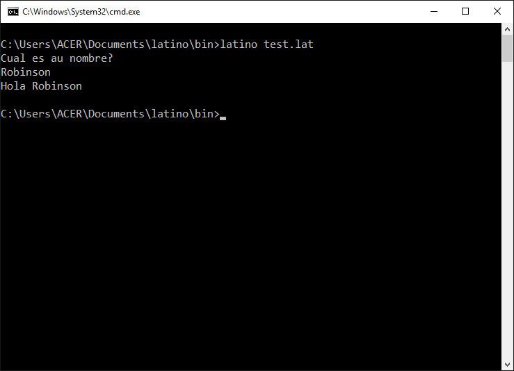

# Básico
Algunas cosas básicas para empezar a programar en Latino


### Mostrar algo en pantalla

```
escribir("Hola Latinos")
```
> También puedes usar el imprimir()

```
imprimir("Hola latinos")
```


### Obtener un valor del usuario via la consola
Si quieres interactuar con el usuario y pedirle que introdusca alguna información, puedes usar este formato para hacerlo 
```
leer()
```
Esto lee lo que el usuario escribe, y lo podrias asignar a una variable para poder trabajar con los valores recojidos.
Ejemplo

```
escribir("Cual es tu nombre?")
nombre = leer()
escribir("Hola " . nombre)
```
> .  Usamos para contatenar (para juntar)



