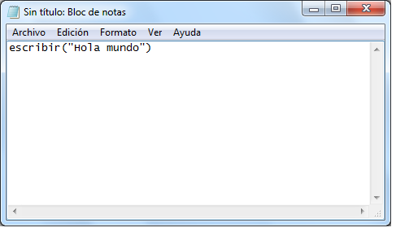
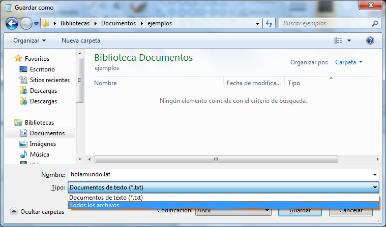
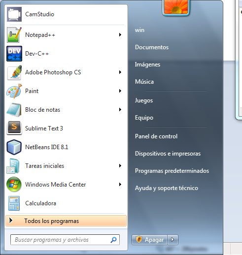
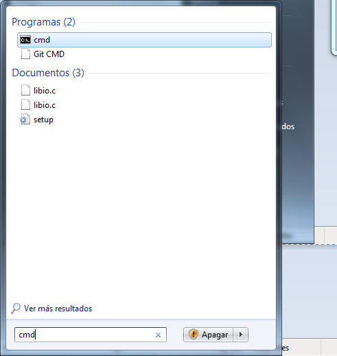
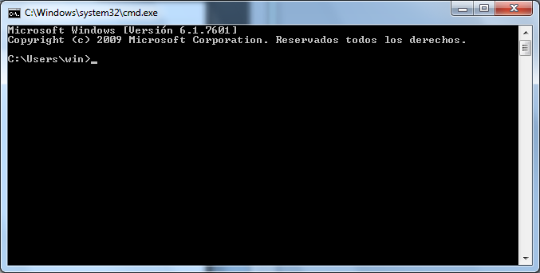
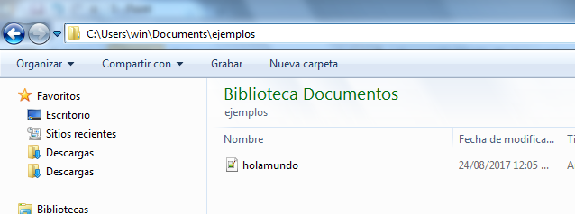
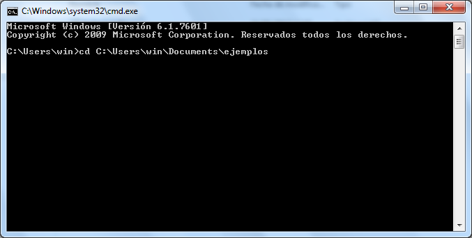
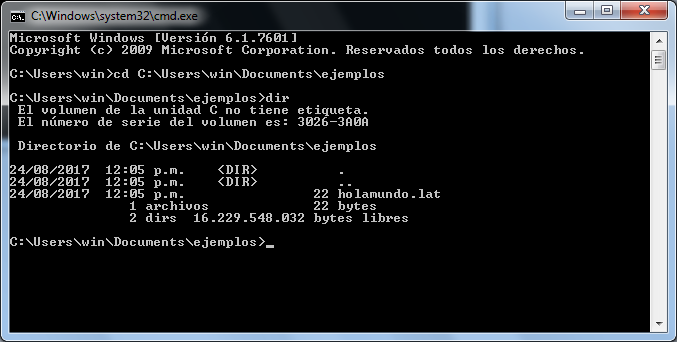
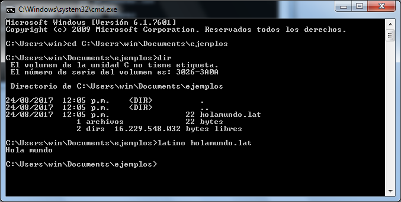

# Hola mundo

Asi es como haces tu primer Hola mundo.

```text
escribir("Hola mundo")
```

Paso a paso

Abres el bloc de notas y escribes el el mensaje que deseas mostrar



Ahora registrar ese documento con la extencion .lat, muy importante la exteción



ahora vas en busqueda de la consola o terminal de windows







ahora debes posicionarte en la carpeta donde registraste el documento



para ello has lo siguiente:



para asegurarte que el documento esta en esa carpeta has un 'dir'



Ahora escribe en la consola

```text
latino holamundo.lat
```

y das a "enter" y te saldra lo siguiente,



haz realizado tu hola mundo con "Latino"

